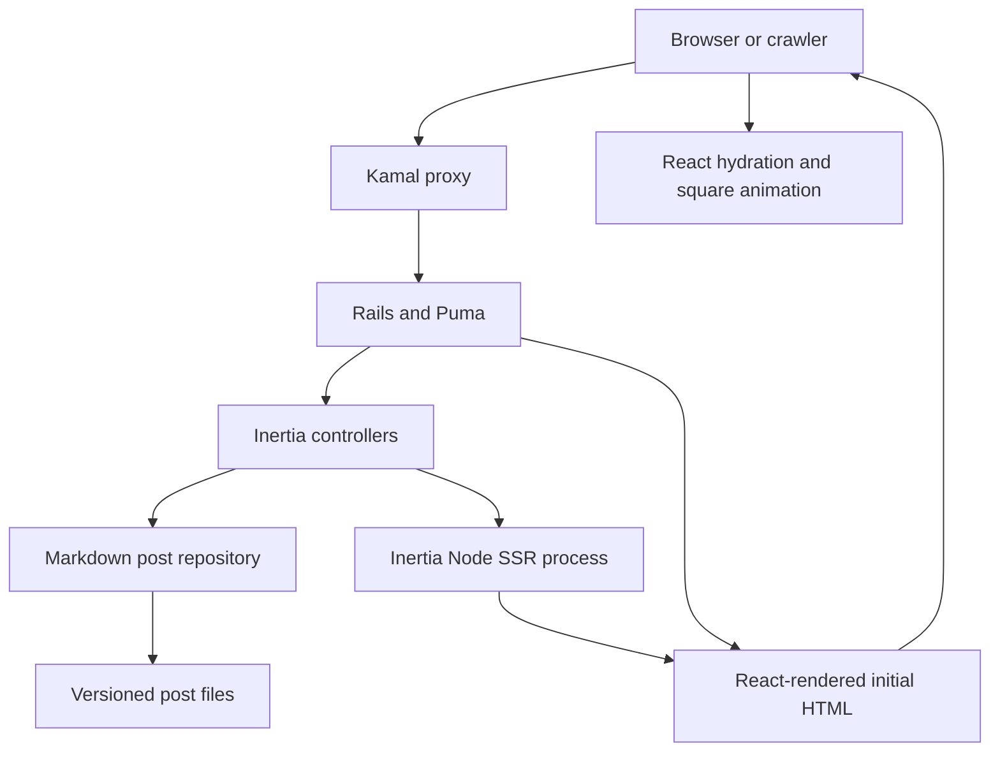
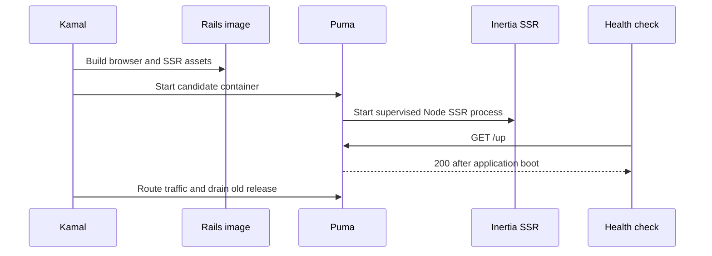

# refactor: Migrate the site to Rails, Inertia SSR, and Kamal

## Summary

Replace the Bridgetown static site with a stateless Rails 8.1.3 application whose React 19 pages are delivered through Inertia 3 and server-rendered in production. Preserve the existing posts, visual identity, metadata, and public URLs while replacing Netlify delivery with a Kamal 2.11 container deployment patterned after the working `pruf` application.

---

## Problem Frame

The repository is pinned to Ruby 2.7.4, Bridgetown 1.3, Tailwind 3, and a Netlify build from 2023. The requested destination is the current Rails/Kamal/Inertia stack already exercised by `pruf`, including production SSR. This is a framework replacement rather than an in-place Rails upgrade, so content and URL compatibility must be characterized before the old runtime is removed.

---

## Requirements

**Runtime and rendering**

- R1. Run the site on Rails 8.1.3 with Rails 8.1 defaults and the Ruby 3.4.2 baseline shared by `pruf`.
- R2. Deliver the browser UI with React 19 and `@inertiajs/react` 3, using `inertia_rails` 3 and Vite Ruby rather than a separate JSON API or client router.
- R3. Server-render every public Inertia page, hydrate that markup without mismatches, and fail fast during development or tests when SSR breaks.

**Content and experience**

- R4. Preserve all 16 Markdown posts, their frontmatter, embedded HTML, rendered code blocks, chronological ordering, and discoverable public URLs.
- R5. Preserve the home, about, posts index, 404 behavior, page metadata, responsive layout, animated square background, and recognizable typography and spacing.

**Delivery and operations**

- R6. Build a production image that contains both browser and SSR bundles plus a Node 22 runtime, exposes a Rails health endpoint, and runs as a non-root user.
- R7. Deploy with Kamal 2.11 through an environment-driven configuration that keeps hosts, registry identity, SSH topology, and secrets out of version control.
- R8. Remove Bridgetown, Turbo, Stimulus, Yarn, Netlify, and their generated configuration after equivalent Rails/Inertia behavior is verified.
- R9. Provide automated request, content, SSR, TypeScript, asset-build, and container checks plus current local-development and deployment documentation.

---

## Scope Boundaries

### In Scope

- The complete runtime, rendering, frontend, test, container, and deployment migration.
- Content-file relocation only when it improves the Rails content boundary; article prose is not rewritten.
- Compatibility redirects or route aliases discovered from the characterized Bridgetown output.

### Deferred to Follow-Up Work

- A CMS, database-backed authoring, search, feeds, comments, authentication, and an admin surface.
- Editorial changes to article prose and a visual redesign beyond fidelity fixes needed for the new renderer.

### Out of Scope

- Reusing Pruf's collaborative-document, account, persistence, Action Cable, or OAuth features.
- Deploying to production as part of implementation; this change prepares and validates the deployment contract without assuming production host credentials.

---

## Key Technical Decisions

- KTD1. **Use a stateless Rails application:** Posts remain version-controlled Markdown, so Active Record, Active Storage, Action Cable, Action Mailbox, Action Text, and Solid Queue are excluded rather than adding unused databases and volumes.
- KTD2. **Treat the current generated site as a compatibility fixture:** Characterize the existing output before removal, then assert equivalent routes, metadata, and article availability from Rails.
- KTD3. **Model posts as immutable Ruby value objects backed by files:** A dedicated repository parses frontmatter, validates required fields and unique slugs, orders posts by date, and renders trusted repository content through CommonMarker with the HTML and code extensions existing articles require.
- KTD4. **Use the official Inertia 3 Vite integration and Puma SSR plugin:** One TypeScript entrypoint serves browser and SSR builds; the Puma plugin owns the production Node process, crash recovery, and shutdown instead of a hand-rolled background process.
- KTD5. **Enable SSR globally with separate readiness and smoke signals:** This public content site benefits from complete first responses and crawler-visible article content on every route. Rails `/up` remains the container readiness gate, while production smoke verification inspects rendered article prose because the intended CSR fallback means Rails health alone cannot prove SSR health.
- KTD6. **Keep the visual behavior in React/CSS:** The square canvas becomes an SSR-safe React component whose initial markup is deterministic and whose animation starts only in an effect.
- KTD7. **Use Kamal's standard stateless deployment shape:** No persistent accessory or volume is required; configuration values come from ignored `.kamal` environment and secrets files, and `/up` gates proxy cutover.
- KTD8. **Use npm and committed lockfiles:** This aligns Rails, Vite, and Docker builds with `pruf` and removes the stale Yarn toolchain.

---

## High-Level Technical Design

The diagram is directional guidance; implementation details may adapt to generator output while preserving these boundaries.

Production delivery follows one container lifecycle:

---

## Implementation Units

### U1. Establish the Rails 8.1 application baseline

- **Goal:** Replace the legacy runtime scaffold with a minimal Rails application that boots locally and in tests without a database.
- **Requirements:** R1, R8, R9.
- **Dependencies:** None.
- **Files:** `Gemfile`, `Gemfile.lock`, `.ruby-version`, `Rakefile`, `config.ru`, `config/application.rb`, `config/boot.rb`, `config/environment.rb`, `config/environments/development.rb`, `config/environments/test.rb`, `config/environments/production.rb`, `config/initializers/`, `config/puma.rb`, `bin/rails`, `bin/rake`, `bin/setup`, `bin/dev`, `test/test_helper.rb`.
- **Approach:** Generate from Rails 8.1.3 with Rails 8.1 defaults, keep only framework railties needed for controllers and views, and retain standard security, logging, and health-check configuration.
- **Patterns to follow:** Rails 8.1 generated application structure and `pruf/config/application.rb`, without copying Pruf's database-backed services.
- **Test scenarios:** The application boots in test; `/up` returns 200; no database configuration or database preparation is required; production configuration loads with dummy secrets.
- **Verification:** Rails reports 8.1.3, the test environment initializes cleanly, and stale Bridgetown executables are no longer part of the boot path.

### U2. Introduce the file-backed post domain and compatibility routes

- **Goal:** Make every existing article available through validated Rails-owned content objects while preserving public route behavior.
- **Requirements:** R4, R5.
- **Dependencies:** U1.
- **Files:** `app/models/post.rb`, `app/repositories/post_repository.rb`, `app/controllers/posts_controller.rb`, `app/controllers/pages_controller.rb`, `config/routes.rb`, `content/posts/*.md`, `test/models/post_test.rb`, `test/repositories/post_repository_test.rb`, `test/integration/public_routes_test.rb`.
- **Approach:** Characterize the Bridgetown output first. Parse trusted YAML frontmatter and Markdown separately, reject malformed or duplicate content at load time, render CommonMark plus required embedded HTML, expose canonical post URLs, and add only evidence-backed compatibility aliases.
- **Execution note:** Add characterization assertions for routes and metadata before removing Bridgetown files.
- **Patterns to follow:** Existing frontmatter in `src/_posts/*.md`; plain Ruby model boundaries rather than Active Record.
- **Test scenarios:** All 16 files load; required title/date/description fields are present; slugs are unique; category strings normalize consistently; posts sort newest-first; raw SoundCloud iframe markup survives; fenced code renders; an unknown slug returns the Rails 404 response; every characterized legacy URL resolves or redirects permanently to its canonical article.
- **Verification:** The repository exposes exactly the legacy article set and request tests prove every public route and compatibility path.

### U3. Build the Inertia React interface with global SSR

- **Goal:** Reproduce the public site in Inertia React and return crawler-visible HTML that hydrates correctly.
- **Requirements:** R2, R3, R5, R9.
- **Dependencies:** U1, U2.
- **Files:** `app/controllers/inertia_controller.rb`, `app/views/layouts/application.html.erb`, `app/frontend/entrypoints/inertia.tsx`, `app/frontend/entrypoints/application.css`, `app/frontend/pages/home.tsx`, `app/frontend/pages/about.tsx`, `app/frontend/pages/posts/index.tsx`, `app/frontend/pages/posts/show.tsx`, `app/frontend/components/site_header.tsx`, `app/frontend/components/square_background.tsx`, `app/frontend/types/globals.d.ts`, `config/initializers/inertia_rails.rb`, `config/vite.json`, `vite.config.ts`, `package.json`, `package-lock.json`, `tsconfig.json`, `tsconfig.app.json`, `tsconfig.node.json`, `Procfile.dev`, `test/integration/inertia_pages_test.rb`, `test/integration/inertia_ssr_test.rb`.
- **Approach:** Install Inertia Rails 3, React 19, Vite 8, and the official Inertia Vite plugin. Resolve page modules from one entrypoint, use hydration when SSR markup is present, render titles and descriptions in the document head, and isolate browser APIs in effects.
- **Patterns to follow:** `pruf/app/frontend/entrypoints/inertia.tsx`, `pruf/config/vite.json`, and current Inertia Rails SSR guidance, simplified for global SSR and Puma supervision.
- **Test scenarios:** Home SSR contains the introduction and every post title; post SSR contains article prose and matching title/description tags; about and posts index SSR render without JavaScript; unknown pages return 404; client hydration reports no mismatch; square animation does not access browser globals during SSR; TypeScript and both Vite builds succeed.
- **Verification:** Raw HTML responses contain meaningful page content, the SSR process answers render requests, browser navigation remains an Inertia visit, and production asset manifests include browser and SSR bundles.

### U4. Containerize and configure Kamal 2.11 delivery

- **Goal:** Produce a deployable, non-root Rails/Node image and a secret-safe Kamal configuration.
- **Requirements:** R6, R7, R8, R9.
- **Dependencies:** U1, U3.
- **Files:** `Dockerfile`, `.dockerignore`, `config/deploy.yml`, `.kamal/deploy.env.example`, `.kamal/secrets.example`, `.gitignore`, `bin/docker-entrypoint`, `bin/kamal`, `public/404.html`, `public/500.html`.
- **Approach:** Use a multi-stage Ruby slim build, install Node 22 for asset compilation and SSR runtime, compile browser and SSR assets in the image, let Puma supervise SSR, and expose port 80 through Thruster. Terminate TLS at Kamal proxy, force SSL in Rails except for `/up`, retain host-header protection, and parameterize Kamal service, image, hosts, registry, builder, and SSH values.
- **Patterns to follow:** `pruf/Dockerfile`, `pruf/config/deploy.yml`, and `pruf/.kamal/*.example`, removing persistence and OAuth concerns that do not apply here.
- **Test scenarios:** Docker build succeeds from a clean context; the image starts as the Rails user; `/up` returns 200; a public page contains SSR HTML before browser JavaScript runs; terminating the supervised SSR child produces an observable restart; proxy configuration enables TLS for the configured host; production redirects direct HTTP requests while exempting `/up`; unexpected host headers are rejected; missing production credentials fail before deployment; `bin/kamal config` renders from example-shaped environment values; tracked files contain no live secrets or operator-specific hosts.
- **Verification:** A local production container serves browser assets, SSR article HTML, health checks, and static error pages. Kamal accepts the rendered configuration, and the post-deploy smoke outcome distinguishes Rails readiness from SSR availability.

### U5. Remove legacy delivery and document the new operating path

- **Goal:** Leave one coherent Rails/Inertia/Kamal workflow with no stale Bridgetown or Netlify instructions.
- **Requirements:** R8, R9.
- **Dependencies:** U2, U3, U4.
- **Files:** `README.md`, `DEPLOYING.md`, `AGENTS.md`, `.github/workflows/ci.yml`, `bridgetown.config.yml`, `netlify.toml`, `frontend/`, `plugins/`, `server/`, `src/`, `esbuild.config.js`, `postcss.config.js`, `tailwind.config.js`, `yarn.lock`, `bin/bridgetown`, `bin/bt`, `bin/netlify.sh`.
- **Approach:** Delete superseded runtime files only after content and route coverage passes. Document dependency setup, `bin/dev`, test/build checks, environment templates, first deploy, subsequent deploys, rollback, and the requirement to keep deployment identifiers stable.
- **Patterns to follow:** `pruf/AGENTS.md`, `pruf/DEPLOYING.md`, and the Rails 8.1 generated CI baseline.
- **Test scenarios:** CI installs Ruby and npm dependencies, runs Ruby tests and lint/security checks, type-checks TypeScript, and builds both asset targets; repository search finds no executable references to Bridgetown, Netlify, Yarn, Turbo, or Stimulus; setup instructions work from a clean checkout.
- **Verification:** The documented commands match committed scripts, CI is green, and only Rails/Inertia/Kamal production paths remain.

---

## System-Wide Impact

- **Readers and crawlers:** Public pages move from prebuilt static files to Rails responses, but first-response HTML, metadata, and URLs remain available.
- **Authoring:** Posts remain Markdown in git; adding a post now exercises repository validation and Rails tests rather than a Bridgetown build.
- **Operations:** Hosting changes from Netlify to a long-running Docker host behind Kamal proxy, introducing server, registry, TLS/DNS, and rollback responsibilities.
- **Performance:** Rails and Node add runtime cost. Immutable content and SSR response caching may be introduced only after baseline measurements show a need.
- **Security:** Trusted repository HTML remains enabled for existing embeds. No user-authored Markdown enters this path, and deployment credentials stay in ignored local files or the shell.

---

## Risks and Mitigations

- **Legacy route drift:** Bridgetown permalink behavior may differ from inferred slugs. Characterize generated output before deletion and retain permanent aliases for observed paths.
- **SSR hydration drift:** Canvas randomness and browser-only APIs can produce mismatches. Keep server markup deterministic and start animation in a client effect.
- **Markdown fidelity:** Renderer differences can alter embeds or code markup. Assert representative raw HTML, fenced code, links, headings, and images before accepting the migration.
- **Single-container process lifecycle:** Rails intentionally remains available when SSR fails, so `/up` cannot represent both services. Use the supported Puma plugin, raise in non-production, log production fallbacks, and verify crawler-visible article prose after container start and deployment.
- **Deployment identity mistakes:** Changing Kamal service names or host values can create a parallel application. Put identifiers in a documented ignored environment file and call out stability requirements.
- **Large replacement diff:** Generated Rails files can obscure content loss. Preserve post moves as renames where possible and verify the exact article count and content checksums.

---

## Documentation and Operational Notes

- `README.md` becomes the local development and content-authoring entry point.
- `DEPLOYING.md` documents `.kamal/deploy.env`, `.kamal/secrets`, DNS, registry login, `kamal setup`, `kamal deploy`, logs, and rollback.
- `AGENTS.md` records the `bin/dev` Vite proxy invariant and the validated deployment command, mirroring relevant guidance from `pruf`.
- A production smoke check fetches a representative article without executing JavaScript and confirms the article body is present. Failure keeps Rails serving through CSR fallback but blocks declaring the rollout verified; operators inspect SSR logs and may roll back with Kamal while correcting the image.
- Production rollout remains a separate operator action because host, DNS, registry, and secret values are not present in this repository.

---

## Sources and Research

- Existing site structure and content: `src/_posts/*.md`, `src/_layouts/`, `src/_components/shared/navbar.*`, `frontend/javascript/controllers/square_bg_controller.js`, and `tailwind.config.js`.
- Same-stack implementation reference: `pruf/Gemfile`, `pruf/package.json`, `pruf/config/initializers/inertia_rails.rb`, `pruf/app/frontend/entrypoints/inertia.tsx`, `pruf/vite.config.ts`, `pruf/Dockerfile`, and `pruf/config/deploy.yml`.
- Rails releases: [Rails 8.1.3 is the current release](https://www.rubyonrails.org/releases).
- Inertia Rails: [server-side rendering with Inertia 3, Vite, Node 22, and the Puma plugin](https://inertia-rails.dev/guide/server-side-rendering).
- Inertia Rails: [Rails/Vite server-side setup and root template](https://inertia-rails.dev/guide/server-side-setup).
- Kamal: [installation and deployment lifecycle](https://kamal-deploy.org/docs/installation/) and [configuration reference](https://kamal-deploy.org/docs/configuration/overview/).
- Kamal release evidence: [basecamp/kamal v2.11.0](https://github.com/basecamp/kamal/releases/tag/v2.11.0).
