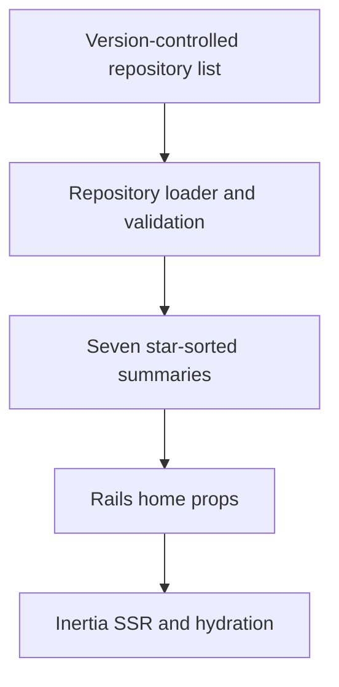

# Home Thoughts and Code Sections - Plan

## Goal Capsule

- **Objective:** Make the home page a concise portfolio by showing up to seven recent thoughts and up to seven highest-starred public GitHub repositories from a maintained snapshot.
- **Authority:** The Product Contract defines visible behavior. The Planning Contract defines the implementation mechanism.
- **Execution profile:** Extend the current repository-backed content, Rails-owned Inertia props, and React card-grid patterns without adding a runtime API dependency.
- **Stop conditions:** Stop if repository metadata cannot be represented as trusted version-controlled content or if the complete Thoughts index would be truncated with the home preview.
- **Tail ownership:** The implementation includes automated tests, browser verification, and production bundle verification.

---

## Product Contract

### Summary

The home page will show the seven newest Thoughts, a clear path to the complete Thoughts archive, and a Code section containing seven public repositories ordered by star count. The full Thoughts index remains unchanged.

### Problem Frame

The home page currently renders every local and external article. The growing list makes the page less useful as a quick introduction to Kieran's work, while public code projects are absent even though they are a second important body of work.

### Requirements

**Thoughts discovery**

- R1. The home page shows up to the seven newest entries from the combined local and Every Thoughts collection; when fewer than seven exist, it shows all of them.
- R2. The home page always provides a visible More control that opens the existing complete Thoughts index.
- R3. The complete Thoughts index continues to show every Thought in its existing newest-first order.

**Code discovery**

- R4. The home page includes a Code section below Thoughts.
- R5. The Code section shows up to seven public, non-archived, source repositories owned by `kieranklaassen` and recorded in the maintained snapshot, ordered by descending GitHub star count and then repository name.
- R6. Each repository card links to GitHub and shows its name, description when present, primary language when present, and star count.
- R7. The Code section provides a More control that opens Kieran's GitHub repositories page.
- R8. Repository metadata comes from a version-controlled content file. Before it reaches page props, each entry is validated for required name, HTTPS GitHub URL owned by `kieranklaassen`, non-negative integer star count, boolean eligibility flags, and unique name and URL. Public, non-archived, and source status are author-asserted snapshot facts; malformed content fails fast instead of rendering.

**Rendering and accessibility**

- R9. Repository data is delivered through Rails-owned Inertia props so server rendering and the first hydrated render remain identical.
- R10. More controls and repository cards are keyboard reachable, have clear labels, and preserve visible focus treatment.

### Acceptance Examples

- AE1. **Covers R1-R3.** Given more than seven Thoughts, when a visitor opens the home page, then seven newest cards appear and More opens `/posts`, where the complete collection appears.
- AE2. **Covers R4-R7.** Given public repositories with different star counts, when a visitor opens the home page, then the Code section shows at most seven source repositories in descending star order and each card opens its GitHub URL.
- AE3. **Covers R8-R9.** Given the repository content file has no entries, when a visitor opens the home page, then the page still responds successfully and renders a quiet Code empty state without a hydration mismatch.

### Scope Boundaries

- The work does not add repository detail pages, search, filters, contribution graphs, private repositories, or GitHub authentication for visitors.
- The work does not change Thought card content, article ordering, post routes, or the complete Thoughts index layout.
- The work does not add a database, live GitHub request, or recurring synchronization job.

---

## Planning Contract

### Key Technical Decisions

- KTD1. **Store a maintained snapshot of the highest-starred public source repositories as version-controlled content.** (session-settled: user-directed — chosen over live GitHub API loading: real-time data is not needed.) A YAML file follows the site's existing Every-publication content pattern and keeps the home page independent of GitHub availability. The file may contain more than seven eligible entries; the loader owns final ordering and selection.
- KTD2. **Treat star counts as maintained snapshot metadata and sort in the repository layer.** The content file records repository facts, while the loader filters eligibility, orders by descending stars with a repository-name tie-breaker, and returns seven entries. A database was rejected because this small trusted collection needs no runtime writes or persistence service.
- KTD3. **Keep the complete Thoughts collection at the repository boundary and limit only the home-page projection.** The `/posts` route remains the canonical archive while the home controller receives a seven-item slice.
- KTD4. **Reuse the existing glass-panel grid language.** Repository cards and More controls should feel native to the current page while remaining visually distinct enough to scan as Code rather than Thoughts.

### High-Level Technical Design

### Assumptions

- “My public repositories” means repositories owned by `kieranklaassen`; forks and archived repositories are excluded from the featured Code section.
- Both home-page sections use a seven-item preview and a More control. Thoughts More goes to `/posts`; Code More goes to `https://github.com/kieranklaassen?tab=repositories`.
- GitHub star counts are a maintained snapshot and may lag behind GitHub. The list should be refreshed when repository prominence changes; exact real-time counts are not required.
- An empty Code collection renders a small non-blocking empty state instead of hiding the heading or surfacing a technical error to visitors.

### Risks and Dependencies

- Snapshot metadata can drift from GitHub. The content format and README guidance must make manual updates obvious, while tests must depend only on repository fixtures rather than current GitHub values.
- Repository descriptions are trusted project content, but URLs must still be validated as public `https://github.com/kieranklaassen/...` links to prevent accidental off-domain cards.
- Duplicate repository names or URLs would create repeated cards. The loader rejects invalid or duplicate records using the same fail-fast posture as the existing external-publication loader.

### System-Wide Impact

- **Request latency:** Repository data loads from local trusted content and introduces no network I/O or new service dependency.
- **Failure propagation:** Invalid checked-in metadata fails fast at the repository boundary during development and tests instead of reaching React as a malformed card.
- **Content lifecycle:** Star counts and descriptions change only when the YAML snapshot changes, so deployments are deterministic and reviewable.
- **Rendering:** Rails passes one normalized payload to both Inertia SSR and hydration. No effect, loading transition, or client refetch changes first-render markup.

### Sources and Research

- `app/controllers/pages_controller.rb` owns home-page props.
- `app/repositories/thought_repository.rb` owns the combined newest-first Thoughts collection.
- `app/frontend/pages/home.tsx` and `app/frontend/components/post_list.tsx` establish the section and card-grid patterns.
- `content/external_posts.yml` and `app/repositories/external_post_repository.rb` establish the trusted version-controlled external-content pattern.

---

## Implementation Units

### U1. GitHub repository content projection

- **Goal:** Produce a validated, deterministic list of public repository summaries from version-controlled content.
- **Requirements:** R5, R6, R8, R9; KTD1, KTD2.
- **Dependencies:** None.
- **Files:** `content/github_repositories.yml`, `app/repositories/github_repository.rb`, `test/repositories/github_repository_test.rb`, `README.md`.
- **Approach:** Add a YAML list containing the repository name, GitHub URL, description, primary language, star snapshot, and eligibility flags needed by the UI. Add a repository boundary that validates and normalizes the records, excludes archived or forked entries, sorts by stars and name, limits the result to seven, and freezes the collection. Document how to refresh the snapshot manually.
- **Patterns to follow:** Mirror the class-level, immutable collection interface in `app/repositories/thought_repository.rb` and the validation-focused tests in `test/repositories/external_post_repository_test.rb`.
- **Test scenarios:**
  1. Given a well-formed content file, normalization sorts by descending stars, breaks equal-star ties by name, and produces only the card fields.
  2. Given forks, archived entries, and more than seven eligible records, the projection excludes ineligible entries and returns seven records.
  3. Given missing descriptions or languages, normalization preserves a valid card payload with nullable optional fields.
  4. Given a duplicate name or URL, the loader raises a clear content-validation error.
  5. Given a non-GitHub URL, a negative or non-integer star count, or a missing required field, the loader raises a clear content-validation error.
  6. Given an empty YAML list, the projection returns an empty immutable collection.
  7. Given the checked-in `content/github_repositories.yml`, the loader validates and normalizes the real shipped content without raising.
- **Verification:** Repository tests prove the checked-in content and fixtures satisfy validation, eligibility filtering, ordering, limiting, optional fields, and empty input without network access.

### U2. Home Thoughts preview and Code props

- **Goal:** Give the home page its bounded Thoughts and Code collections while preserving the full archive.
- **Requirements:** R1, R3, R5, R8, R9; KTD3.
- **Dependencies:** U1.
- **Files:** `app/repositories/thought_repository.rb`, `app/controllers/pages_controller.rb`, `test/repositories/thought_repository_test.rb`, `test/integration/public_routes_test.rb`.
- **Approach:** Add a bounded recent-Thoughts projection or equivalent repository-level operation for the home action. Keep the posts index on the complete collection. Add the normalized Code collection to the home Inertia props and use repository stubs in integration tests to cover populated and empty Code states explicitly.
- **Patterns to follow:** Continue passing explicit props from Rails controllers and keep `ThoughtRepository.all` as the complete canonical collection.
- **Test scenarios:**
  1. **Covers AE1.** The home response contains the first seven entries from `ThoughtRepository.all` in identical order and exposes no later entry.
  2. **Covers AE1.** The posts index response still contains every Thought.
  3. **Covers AE2.** The home response includes the normalized Code collection from the repository content boundary.
  4. **Covers AE3.** An empty Code collection still produces a successful home response.
- **Verification:** Repository and integration tests prove the home-only limit, unchanged archive behavior, and Rails-owned Code props.

### U3. Code cards and More controls

- **Goal:** Render the concise home-page portfolio with accessible paths to the complete writing and code collections.
- **Requirements:** R2, R4, R6, R7, R10; KTD4.
- **Dependencies:** U2.
- **Files:** `app/frontend/pages/home.tsx`, `app/frontend/components/repository_list.tsx`, `app/frontend/components/repository_list.test.tsx`, `app/frontend/types/page.ts`, `test/integration/inertia_ssr_test.rb`.
- **Approach:** Add the Thoughts More control beside its heading, then render a Code section below the Thoughts preview. Repository cards open external GitHub pages safely and use semantic labels for language and stars. The empty state remains compact. Keep all initial output prop-driven so SSR and hydration match.
- **Patterns to follow:** Reuse `PostList` grid sizing, `glass-panel` card treatment, external-link safety attributes, and existing visible-focus utilities.
- **Test scenarios:**
  1. **Covers AE1.** Static home markup includes a More link to `/posts` adjacent to the Thoughts heading.
  2. **Covers AE2.** Repository cards render names, optional descriptions, languages, star counts, and external-link safety attributes.
  3. A repository without a description or language omits the absent metadata without leaving empty visual labels.
  4. The Code More control points to Kieran's GitHub repositories page and opens safely as an external link.
  5. **Covers AE3.** An empty repository collection renders the quiet empty state in both server and browser markup.
  6. Both More controls and repository cards are reachable in tab order and carry the shared visible-focus utility classes.
- **Verification:** Frontend tests assert card and link semantics, strict SSR includes both section headings and prop-driven repository content, and browser review confirms responsive grid balance and visible keyboard focus at mobile and desktop widths.

---

## Verification Contract

| Gate | Applies to | Done signal |
|---|---|---|
| `bin/rails test` | U1, U2, U3 | Content-repository, route, and non-strict SSR tests pass. |
| `npm run test:frontend` | U3 | Repository-card, More-control, empty-state, and existing component tests pass. |
| `npm run check` | U3 | Browser and SSR TypeScript projects compile without type errors. |
| `npm run build` | U3 | Production browser and SSR bundles build successfully. |
| Strict Inertia SSR test with the built renderer | U3 | Raw home HTML contains the bounded Thoughts section, Code heading, and repository content with no hydration-only dependency. |
| `bin/rubocop` | U1, U2 | Ruby changes satisfy repository style. |
| `bin/brakeman --no-pager` | U1, U2 | No new security warning is introduced. |
| Browser review through Rails-proxied Vite | U3 | Mobile and desktop layouts show clear section boundaries, More controls are discoverable, keyboard focus is visible, and external cards behave correctly. |

---

## Definition of Done

- The home page shows seven newest Thoughts and links to the unchanged complete Thoughts index.
- The home page shows a Code section with up to seven eligible repositories in deterministic star order and a link to the complete GitHub repositories page.
- Repository metadata is version-controlled, validated, and deterministic; the home page performs no GitHub API request.
- Rails owns all initial page props; raw SSR contains the visible sections and repository content when data is available.
- Automated Ruby, frontend, type, production-build, style, security, strict SSR, and responsive browser checks pass.
- No database, background synchronization, or private token is introduced.
- Dead-end, duplicate, or experimental code from implementation is removed before shipping.
